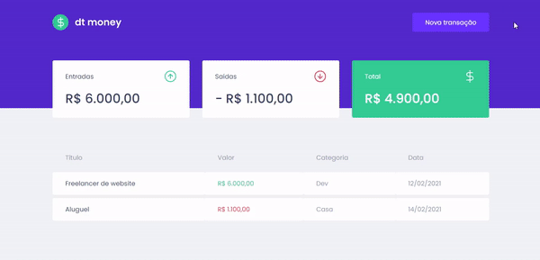
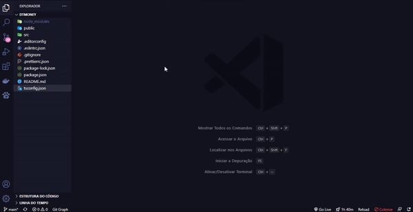

# Learning ReactJs e NextJs
 ReactJs e NextJs na RocketSeat

 ✓ Working With Javascript!  
 ✓ Working With TypeScript!  
 ✓ Working With React!  
 ✓ Working With React-Icons!  
 ✓ Working With React-Hooks!  
 ✓ Working With React-Context!  
 ✓ Working With NextJs!  
 ✓ Working With Next-Auth!  
 ✓ Working With Prismic!  
 ✓ Working With Prismic-dom!  
 ✓ Working With Stripe!  
 ✓ Working With Stripe-Hooks!  
 ✓ Working With SASS!  
 ✓ Working With styled-components!  
 ✓ Working With Modal!  
 ✓ Working With Axios!  
 ✓ Working With FaunaDB!  
 ✓ Working With MirageJs!  
 ✓ Working With Polished!  

 <h1>✅Projects</h1>
 <h3>📚 Dt Money</h3>

 <h6 align="center">
   
 </h6>
 <h2></h2>

 <h3>📚 Código</h3>
 <h6 align="center">
    
  </h6>
g

